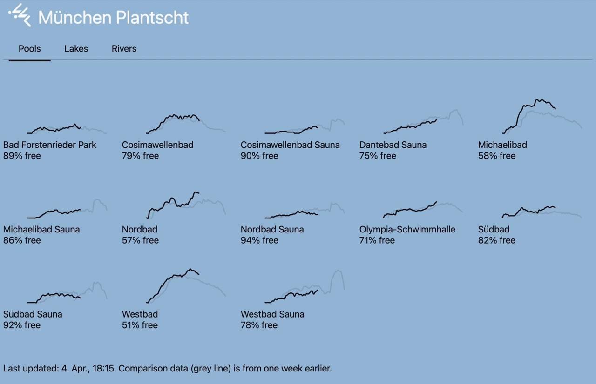

# München Planscht

Real-time filling level indicator of Munich swimming pools, with historical data.



## Architecture

This repository contains **only the frontend**. The backend — database,
scheduled scrapers (cron jobs), and the JSON API the frontend consumes — lives
on [Val Town](https://val.town) in the val
[`fgeierst/muenchen-plantscht-v2`](https://www.val.town/x/fgeierst/muenchen-plantscht-v2).

The backend provides:

- **SQLite storage** for pool occupancy, water temperatures, and catalog tables.
- **Cron jobs** that scrape SWM pool occupancy and GKD/Feringasee water
  temperatures on a schedule.
- **HTTP API endpoints**, e.g. pool occupancy:
  `https://muenchen-plantscht-pools.val.run/?date=YYYY-MM-DD`

To work on the backend, use the Val Town MCP / web editor, not this repo.

## Quickstart

```bash
pnpm install
pnpm dev
```

## Deployment

The frontend is deployed to Cloudflare Workers (with Workers Assets) via
[`@sveltejs/adapter-cloudflare`](https://kit.svelte.dev/docs/adapter-cloudflare).
Live URL: <https://muenchen-plantscht.florian-ff8.workers.dev/>

Build and deploy in one step:

```bash
pnpm deploy
```

That runs `vp build` followed by `wrangler deploy`. Wrangler reads its
configuration from [`wrangler.jsonc`](wrangler.jsonc) and uploads both the
generated Worker script (`.svelte-kit/cloudflare/_worker.js`) and the static
assets in `.svelte-kit/cloudflare/`.

### First-time setup

1. **Authenticate** with Cloudflare (interactive, once per machine):
   ```bash
   npx wrangler login
   ```
2. **Deploy** as above.

### Previewing locally

```bash
pnpm build
npx wrangler dev
```
